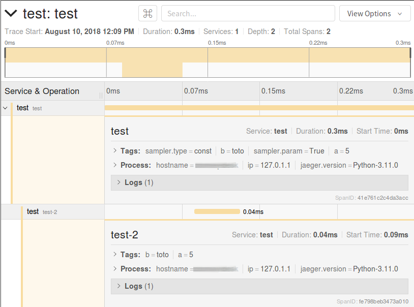

.. cdumay-opentracing documentation master file, created by
   sphinx-quickstart on Fri Aug 10 11:50:47 2018.
   You can adapt this file completely to your liking, but it should at least
   contain the root `toctree` directive.

cdumay-opentracing
==================

cdumay-opentracing is a python library to facilitate opentracing integration.

Example
-------

The following example shows how to use it with `Jaeger <https://www.jaegertracing.io/docs/>`_:

.. code-block:: python
   :linenos:

   import opentracing
   from cdumay_opentracing import OpenTracingDriver, OpenTracingSpan

   class A(object):
       "A sample class"
       def __init__(self):
           self.a = 5
           self.b = "toto"
           self.trace = dict()

   class B(A):
       """A class which inherit of A"""

   class DriverA(OpenTracingDriver):
       @classmethod
       def extract(cls, data):
           return opentracing.tracer.extract(cls.FORMAT, data.trace)

       @classmethod
       def inject(cls, span, data):
           opentracing.tracer.inject(span, cls.FORMAT, data.trace)

       @classmethod
       def tags(cls, data):
           return dict(a=data.a, b=data.b)

   def child():
       """A function that automatically recovers the current span"""
       with OpenTracingSpan(B(), "test-2") as span:
           span.log_kv(dict(event="done"))

   if __name__ == '__main__':
       import os, time
       from jaeger_client import Config
       from cdumay_opentracing import OpenTracingManager

       tracer = Config(service_name="test", config=dict(
           sampler=dict(type='const', param=1), logging=True,
           local_agent=dict(reporting_host=os.getenv('JAEGER_HOST', 'localhost'))
       )).initialize_tracer()

       OpenTracingManager.register(A, DriverA)

       a = A()
       with OpenTracingSpan(a, "test") as span:
           child()
           OpenTracingManager.log_kv(span, a, "done")

       time.sleep(4)
       tracer.close()

Explanations
************

* **line 5-14**: We create classes for our example.
* **line 17-28**: We create a driver which allows to automate the manipulation of the class :code:`A`.
* **line 38-45**: We initialize tracing
* **line 47**: We register the driver into the Tracing manager. It will allow to manipulate :code:`A` instances (and by extension :code:`B`).
* **line 49-50**: We make a span using :code:`a`.
* **line 51**: We call a function from a span which will create a sub-span.
* **line 54-55**: We sleep and close to make sure that the span is sent.

Get It Now
----------

Install the lib using `pip <https://pip.pypa.io/en/stable/>`_::

    pip install -U cdumay-opentracing

Features & API Focus
--------------------

.. toctree::
   :maxdepth: 1

   manager.rst
   driver.rst